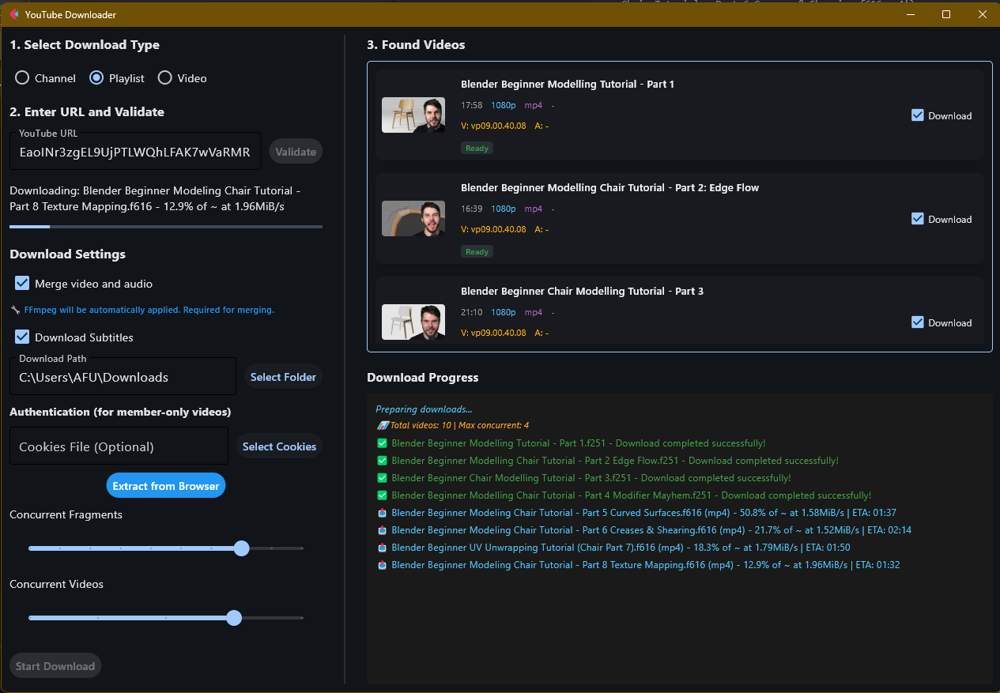
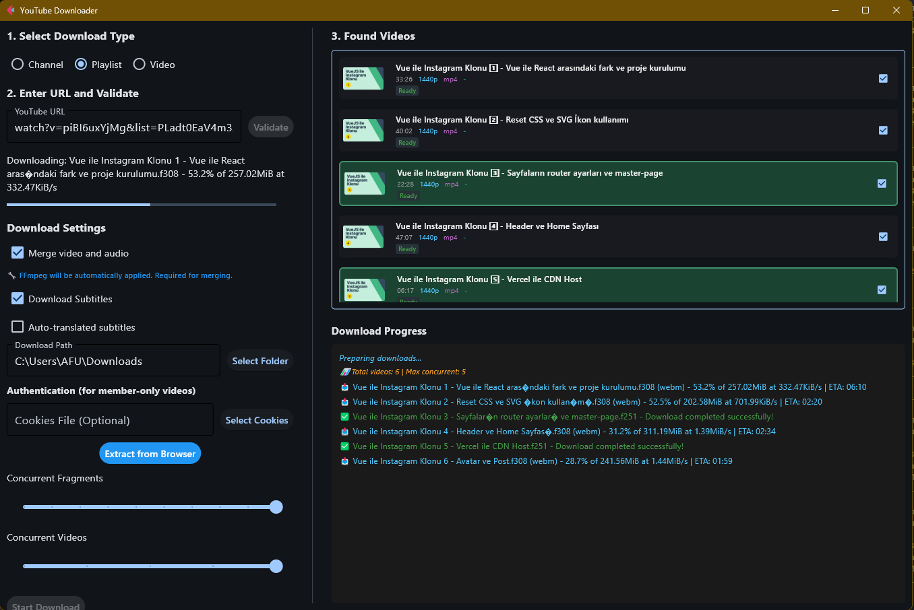

# YouTube Channel Downloader

<p align="center">
  
</p>

This application is a desktop tool developed for downloading content from YouTube channels, playlists, and videos.

## 🚀 Quick Start

### Option 1: Use Pre-built Executable (Recommended)
You can run the application directly without installing Python:

1. Download the latest executable from the [Releases](https://github.com/your-username/ytdlp-gui/releases) page
2. Or use the pre-built executable in the `dist` folder:
   ```bash
   # Windows
   dist/YouTube-Downloader.exe
   ```
3. Double-click the executable to run the application
4. No Python installation required!

### Option 2: Run from Source
If you want to run from source code:

1. Python 3.7+ must be installed
2. Install the required packages:
   ```bash
   pip install -r requirements.txt
   ```
3. Install yt-dlp:
   ```bash
   pip install yt-dlp
   ```
4. Run the application:
   ```bash
   python main.py
   ```

## 🎯 Features

- Download from YouTube channels, playlists, and videos
- Cookies support for member-only videos
- **Automatic cookie extraction** (from Edge, Chrome, and Firefox)
- Video quality selection
- Subtitle download option
- Concurrent download settings
- Modern and user-friendly interface
- Real-time download progress
- **Portable executable** - no installation required

<p align="center">
  
</p>

## 🚀 Usage

1. **Using the executable (easiest)**:
   - Double-click `dist/YouTube-Downloader.exe`
   - Or run from command line: `dist/YouTube-Downloader.exe`

2. **Using Python source**:
   ```bash
   python main.py
   ```

3. In the opened interface, select the download type (Channel, Playlist, Video)
4. Enter the YouTube URL and click the "Validate" button
5. Configure the download settings:
   - Video quality
   - Subtitle download
   - Download folder
   - Cookies file (for member-only videos)
   - Number of concurrent downloads
6. Click the "Start Download" button to begin downloading
7. You can track the download progress in the interface

## 🍪 Using Cookies for Member-Only Videos

To download member-only videos, you need to use your YouTube cookies file:

### Method 1: Automatic Cookie Extraction (Recommended)

Click the "Extract from Browser" button in the application to automatically extract cookies from your browser.

### Method 2: Manual Cookie Extractor

Run the cookie extractor from the command line:

```bash
# Automatic (tries Edge, then Chrome, then Firefox)
python cookie_extractor.py

# Only from Edge
python cookie_extractor.py --browser edge

# Only from Chrome
python cookie_extractor.py --browser chrome

# Only from Firefox
python cookie_extractor.py --browser firefox
```

### Method 3: Browser Extension
1. Install "Get cookies.txt" or "Cookie Quick Manager" extension for Chrome/Firefox
2. Log in to YouTube
3. Use the extension to download the cookies.txt file

### Method 4: Manual Export
1. Log in to YouTube from your browser
2. Open Developer Tools (F12)
3. Go to the Application/Storage tab
4. Cookies > https://youtube.com
5. Copy all cookies and save them in the following format:

```
# Netscape HTTP Cookie File
.youtube.com	TRUE	/	FALSE	1735689600	VISITOR_INFO1_LIVE	...
.youtube.com	TRUE	/	FALSE	1735689600	LOGIN_INFO	...
```

### Using the Cookies File:
1. Click the "Select Cookies" button in the application
2. Select the cookies.txt file you created
3. You can now download member-only videos

## ⚡ Cookie Extractor Features

- **Automatic Browser Detection**: Automatically finds Edge, Chrome, and Firefox
- **Multi-Platform Support**: Windows, macOS, and Linux
- **Edge Profile Support**: Automatically detects different Edge profile folders
- **Secure Decryption**: Uses Windows DPAPI for secure decryption
- **Netscape Format**: Compatible with yt-dlp
- **Error Handling**: Comprehensive error control and user-friendly messages
- **Works While Browser is Open**: Can extract cookies even if Edge is open

## 🔒 Security Notes

- Keep your cookies file secure, do not share it with others
- The cookies file grants access to your YouTube account
- Update your cookies file regularly
- The cookie extractor only extracts YouTube cookies

## 🔧 Troubleshooting

### "yt-dlp is not installed" Error
```bash
pip install yt-dlp
```

### Cookie Extractor Error
```bash
# Install required dependencies
pip install pycryptodome pywin32 cryptography
```

### Edge Cookies Error
- If cookies cannot be extracted while Edge is open, close Edge and try again
- Or type 'y' when the script asks you to continue
- Automatically detects different Edge profile folders

### Member-only Video Error
- Make sure the cookies file is in the correct format
- Make sure your YouTube account is a member
- Make sure the cookies file is up to date
- Make sure you are logged in to YouTube in your browser

### Download Errors
- Check your internet connection
- Make sure the URL is correct
- Make sure you have enough disk space

### Executable Issues
- If the executable doesn't run, try running it as administrator
- Make sure Windows Defender isn't blocking the file
- Check that you have the latest Windows updates

## 📦 Building Executable

To create standalone executables for all platforms:

### 🪟 Windows
```bash
# Method 1: Using build script (Recommended)
build_exe.bat

# Method 2: Manual build
pip install pyinstaller
python -c "from downloader import Downloader; d = Downloader(); d.setup_ffmpeg()"
pyinstaller youtube_downloader.spec --clean --noconfirm
```

### 🐧 Linux
```bash
# Make script executable
chmod +x build_linux.sh

# Run build script
./build_linux.sh

# Manual build
pip3 install pyinstaller
python3 -c "from downloader import Downloader; d = Downloader(); d.setup_ffmpeg()"
pyinstaller youtube_downloader_linux.spec --clean --noconfirm
```

### 🍎 macOS
```bash
# Make script executable
chmod +x build_macos.sh

# Run build script
./build_macos.sh

# Manual build
pip3 install pyinstaller
python3 -c "from downloader import Downloader; d = Downloader(); d.setup_ffmpeg()"
pyinstaller youtube_downloader_macos.spec --clean --noconfirm
```

### 🚀 Automated Multi-Platform Release

For maintainers to create releases for all platforms:

```bash
# Prepare and create a new release
python prepare_release.py --version patch

# Options:
# --version major|minor|patch (default: patch)
# --dry-run (preview changes)
# --skip-build (skip local build test)
# --force (ignore uncommitted changes)
```

This will:
1. Create a new version tag
2. Push to GitHub
3. Trigger GitHub Actions to build for Windows, Linux, and macOS
4. Automatically create a GitHub release with all executables

### 📦 Executable Features
- **Cross-Platform**: Windows (.exe), Linux (binary), macOS (.app + .dmg)
- **Single File**: Everything bundled into one executable
- **No Dependencies**: No need to install Python or any packages
- **FFmpeg Included**: Video merging works out of the box
- **Portable**: Can be run on any compatible machine
- **Size**: Approximately 70-80MB per platform
- **Ready to Use**: Pre-built executable available in `dist/` folder

### 📁 Distribution Files
- **Windows**: `YouTube-Downloader.exe` (77MB) - Available in `dist/` folder
- **Linux**: `YouTube-Downloader-Linux` (75MB)
- **macOS**: `YouTube-Downloader-macOS.app` bundle or `.dmg` (80MB)

Each executable contains:
- Python runtime
- All required libraries (flet, yt-dlp, cryptography, etc.)
- FFmpeg binary
- Application code

## 📥 Download Options

### Pre-built Executable (Recommended)
- **Direct Download**: Use the executable in `dist/YouTube-Downloader.exe`
- **GitHub Releases**: Download from the [Releases](https://github.com/your-username/ytdlp-gui/releases) page
- **No Installation Required**: Just download and run

### Source Code
- **Clone Repository**: `git clone https://github.com/your-username/ytdlp-gui.git`
- **Download ZIP**: Download source code from GitHub
- **Requires Python**: Python 3.7+ and dependencies needed

## 📄 License

This project is licensed under the MIT License. 