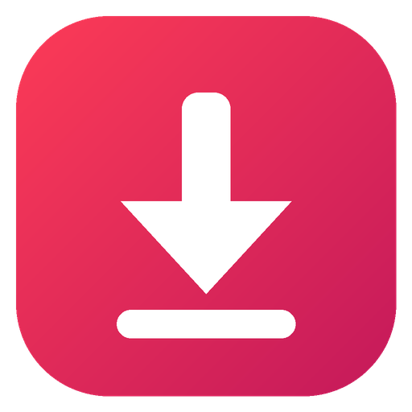
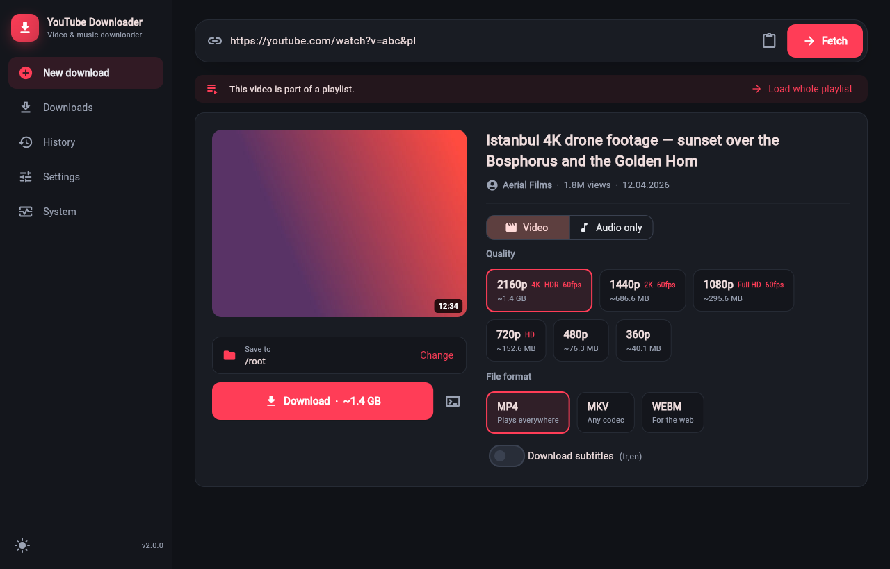
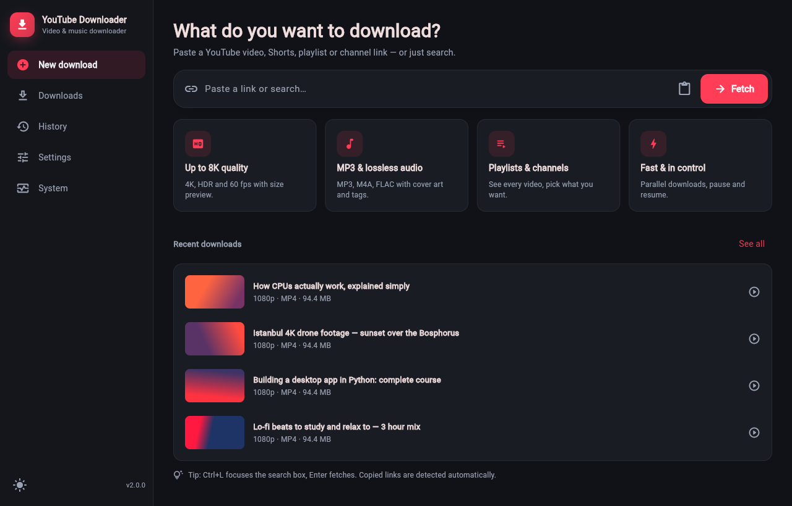
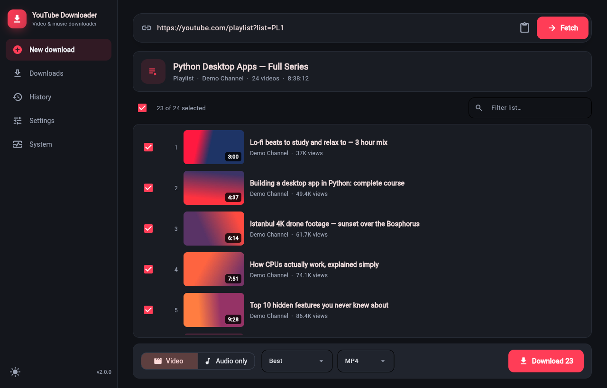
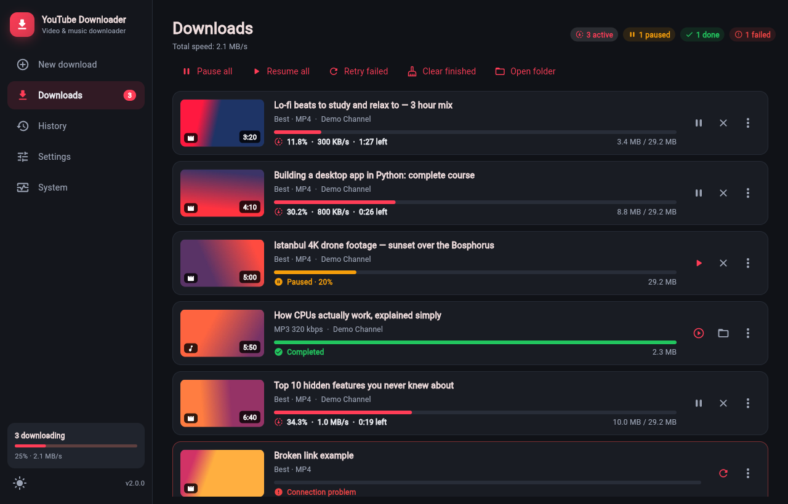
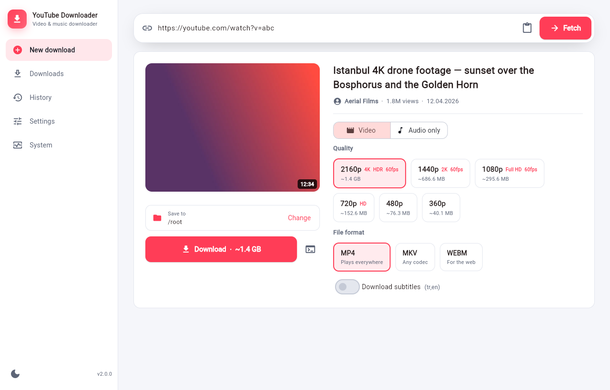

<div align="center">



# YouTube Downloader

**A fast, beautiful desktop app for downloading YouTube videos, Shorts, playlists, channels and music.**
Powered by [yt-dlp](https://github.com/yt-dlp/yt-dlp) · Windows · macOS · Linux · Türkçe & English

[Download](https://github.com/MihrimatriX/ytdlp-gui/releases) · [Features](#features) · [Run from source](#run-from-source) · [Türkçe](#türkçe)



</div>

## Features

- **Paste anything** – video, Shorts, playlist, channel or YouTube Music link. Not a link? It searches YouTube for you.
- **Pick exact quality** – every available resolution up to 8K with HDR/60 fps badges and the **estimated file size** before you download.
- **Audio only** – MP3, M4A, Opus, FLAC or WAV with bitrate choice, cover art and tags embedded.
- **Playlists & channels** – see every video with thumbnails, filter, select what you want and download it into its own folder (optionally numbered).
- **Real download queue** – parallel downloads with live speed, ETA and size; **pause, resume, cancel and retry** each item; taskbar progress.
- **History** – everything you downloaded, searchable, with "open", "show in folder" and "download again".
- **Smart extras** – clipboard link detection, embedded chapters and subtitles, SponsorBlock (mark or cut sponsors), speed limit, proxy, "skip already downloaded" archive.
- **Sign-in when needed** – use your browser's cookies (Chrome, Firefox, Edge, Brave, …) or a `cookies.txt` for age-restricted and members-only videos.
- **Helpful errors** – clear explanations ("YouTube wants to verify you → enable browser cookies") instead of raw logs.
- **Polished UI** – dark & light themes, six accent colours, responsive layout, keyboard shortcuts, Turkish and English.
- **System page** – checks yt-dlp, FFmpeg, JavaScript runtime, connectivity and disk space; installs FFmpeg automatically on Windows and updates yt-dlp when running from source.

<table>
  <tr>
    <td></td>
    <td></td>
  </tr>
  <tr>
    <td></td>
    <td></td>
  </tr>
</table>

## Install

Grab the latest build from the [Releases](https://github.com/MihrimatriX/ytdlp-gui/releases) page:

| Platform | File | Notes |
|---|---|---|
| Windows | `YouTube-Downloader-Windows.zip` | Extract and run `YouTube-Downloader.exe`. FFmpeg is included. |
| macOS | `YouTube-Downloader-macOS.zip` | Unzip and open the app. Install FFmpeg with `brew install ffmpeg`. |
| Linux | `YouTube-Downloader-Linux.tar.gz` | `tar -xzf … && ./YouTube-Downloader-Linux`. Install FFmpeg with `sudo apt install ffmpeg`. |

> **Tip:** For the best YouTube compatibility also install [Deno](https://deno.com) or Node.js – yt-dlp uses a JavaScript runtime to unlock every format. The System page tells you if anything is missing.

## Run from source

Requires Python 3.10+.

```bash
pip install -r requirements.txt
python main.py
```

Development helpers:

```bash
pip install -r requirements-dev.txt
python -m pytest            # unit + end-to-end download tests (needs ffmpeg)
YTDLP_GUI_WEB=1 python main.py   # open the UI in a browser instead of a window
python build.py             # build a standalone executable into ./dist
python build.py --with-ffmpeg    # Windows: bundle FFmpeg too
```

### Keyboard shortcuts

| Shortcut | Action |
|---|---|
| `Ctrl + L` | Focus the link / search box |
| `Enter` | Fetch |
| `Ctrl + 1 … 5` | Switch pages |

## Project layout

```
main.py                 entry point
ytgui/
  engine.py             download queue on the yt-dlp Python API (pause/resume/cancel/retry)
  media.py              metadata extraction, quality & size estimation
  options.py            settings → yt-dlp options (via yt-dlp's own parser)
  settings.py history.py i18n.py errors.py urls.py ffmpeg.py diagnostics.py
  ui/                   Flet views: download, queue, history, settings, system
tests/                  pytest suite (incl. real downloads from a local server)
build.py                cross-platform packaging with `flet pack`
```

Settings, history, the download archive and logs live in your user data folder
(`%LOCALAPPDATA%\ytdlp-gui`, `~/Library/Application Support/ytdlp-gui` or `~/.local/share/ytdlp-gui`).

## Türkçe

**YouTube Downloader**, YouTube videolarını, Shorts'ları, oynatma listelerini, kanalları ve müzikleri indirmek için hızlı ve şık bir masaüstü uygulamasıdır.

- Bağlantıyı yapıştırın ya da doğrudan arama yapın; video, liste ve kanallar otomatik tanınır.
- 8K'ya kadar tüm kaliteler, indirmeden önce **tahmini dosya boyutu** ile listelenir.
- Sadece ses: MP3, M4A, Opus, FLAC, WAV – kapak resmi ve etiketlerle.
- Oynatma listeleri ve kanallarda istediğiniz videoları seçip tek tıkla indirin.
- İndirme kuyruğu: paralel indirme, canlı hız ve kalan süre, **duraklat / devam et / iptal / tekrar dene**.
- Geçmiş, pano algılama, altyazı, bölümler, SponsorBlock, hız sınırı, proxy.
- Yaş sınırlı veya üyelere özel videolar için tarayıcı çerezleri desteği.
- Koyu/açık tema, vurgu renkleri ve tam Türkçe arayüz.

[Sürümler](https://github.com/MihrimatriX/ytdlp-gui/releases) sayfasından işletim sisteminize uygun dosyayı indirip çalıştırmanız yeterli.

---

Please respect YouTube's Terms of Service and copyright law; download only content you have the right to save.
